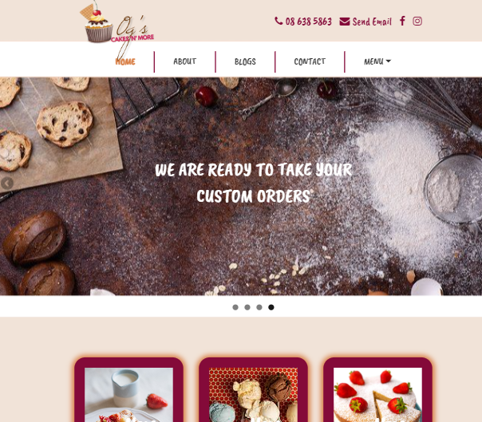

# pastry-wordpress-theme

<!-- PROJECT LOGO -->
 

  

<h3 align="center">Og's Cakes N' More | WordPress Website</h3>

## Table of contents
* [General info](#general-info)
* [Technologies](#technologies)
* [Usage](#usage)
* [Illustrations](#illustrations)
* [Link](#illustrations)
* [Contributing](#contributing)

## General info
This is a **WordPress Theme** design for a pastry shop online.
	
## Technologies
- [Understrap](https://understrap.com)
- [Wordpress](https://wordpress.org)

	
## Usage
*  Download and install [Wordpress](https://wordpress.org) to your local machine or server.
*  Use git clone to clone the repository or
*  Download the zip file.
*  Log into Wordpress and Install the zip file as a new theme under Appearance in Wordpress Dashboard then activate it.
*  To edit the theme, open editor of your choice. 
*  Install required dependencies with npm install.
*  Run the server with npm run watch.

## Illustrations

## Link
Link to Github:
https://github.com/oglili/pastry-wordpress-theme

## Contributing
Pull requests are welcome. For major changes, please open an issue first to discuss what you would like to change.
